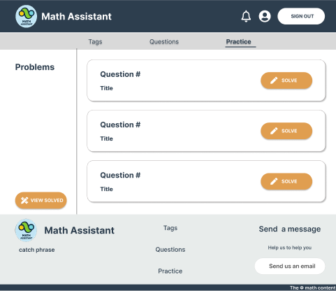
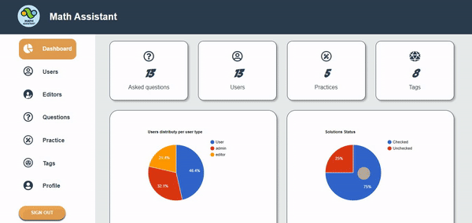

<div align="center">

> Hello world! This is the project’s summary that describes the project plain and simple, limited to the space available.

**[PROJECT PHILOSOPHY](https://github.com/julescript/well_app#-project-philosophy) • [WIREFRAMES](https://github.com/julescript/well_app#-wireframes) • [TECH STACK](https://github.com/julescript/well_app#-tech-stack) • [IMPLEMENTATION](https://github.com/julescript/well_app#-impplementation) • [HOW TO RUN?](https://github.com/julescript/well_app#-how-to-run)**

</div>

<br><br>


> Math Assistant is the place where math isn't your problem anymore :blue_book::triangular_ruler:.
> Stuck while solving a math problem? Post your question on the website by scanning images of the problem or typing it. Other users will help you find the answer. Plus, you can accept answers and vote for the answers to have a better experience. Nevertheless, to unlock voting, you need to have a certain score. Yes, Math Assistant has a scoring system :chart_with_upwards_trend:. And the best part, you can practice solving math problems to enhance your score, get feedback from the editors and be notified when you receive a feedback.

### User Stories

- As a user, I want to scan pictures, so that I can post a question quickly.
- As a user, I want to post questions and answer existing questions.
- As a user, I want to accept suitable answers and vote for better answers.
- As a user, I want to search for question.
- As a user, I want to practice solving math problems and get feedback concerning my solution.
- As a user, I want to be notified when I receive a feedback.

### Editor Stories

- As an editor, I want to check the users and data related to the website.
- As an editor, I want to add tags and practices.
- As an editor, I want to check users' solutions for a practical problem.

<br><br>


> This design was planned before on paper, then moved to Figma app for the fine details.
> Note that i didn't use any styling library or theme, all from scratch and using pure css modules

### User

| Landing                                 | Login                                 |
| --------------------------------------- | ------------------------------------- |
|       |      |
| Sign Up                                 | Tags                                  |
|     |             |
| Questions                               | View Question                         |
|     |     |
| Ask Question                            | Profile                               |
|        |  |
| Practice                                | Exercice                              |
|       |     |
| Solved Practice                         |                                       |
|  |                                       |

### Admin Panel

| Landing                             | Dashboard                                |
| ----------------------------------- | ---------------------------------------- |
|  |      |
| Editors                             | Practice                                 |
|     |  |
| Feedback                            |                                          |
|   |                                          |

<br><br>


Here's a brief high-level overview of the tech stack the Well app uses:

- For a good user experience, this project uses Reacr.js. React.js is a free and open-source front-end JavaScript library for building user interfaces based on UI components.

- To keep the database scalable for this project, the website uses MySQL database. MySQL is an open-source relational database management system (RDBMS).A relational database organizes data into one or more data tables in which data may be related to each other; and it facilitates testing database integrity and creation of backups.

- This project uses also 2 third party APIs:
  - The first is [Firebase](https://firebase.google.com/), integrated in this project for the push notifications.
  - The second is [Mathpix](https://mathpix.com/), its goal is to scan the pictures and extract math equations from it. Mathpix scan handwritten and printed images of math equations and convert them into [Latex](https://openbase.com/js/react-latex), which will help displaying math symbols and complex equations.

<br><br>


> Uing the above mentioned tecch stacks and the wireframes build with figma from the user sotries we have, the implementation of the app is shown as below, these are screenshots from the real app

| Landing                                         | Login/Signup                                    |
| ----------------------------------------------- | ----------------------------------------------- |
|             |  |
| Tags                                            | Profile                                         |
|           |         |
| Feedback and notification                       |                                                 |
|  |

### Admin Panel

| Landing                                          | Login                                            |
| ------------------------------------------------ | ------------------------------------------------ |
|             |  |
| Dashboard                                        | Admin Panel Pages                                |
|        |          |
| Feedback                                         |                                                  |
|  |

<br><br>


> This is an example of how you may give instructions on setting up your project locally.
> To get a local copy up and running follow these simple example steps.

### Prerequisites

This is an example of how to list things you need to use the software and how to install them.

- npm
  ```sh
  npm install npm@latest -g
  ```

### Installation

_Below is an example of how you can instruct your audience on installing and setting up your app._

1. Get a free API Key at [Firebase](https://firebase.google.com/).
2. Get an API Key at [Mathpix](https://mathpix.com/).
3. Clone the repo
   ```sh
   git clone https://github.com/SourayaAbdelKader/math_assistant.git
   ```
4. Install NPM packages
   ```sh
   npm install
   ```
   :o: Some dependence may cause conflicts, for that reason you can run the following command to solve them.
   ```sh
   npm install --force
   ```
5. Change the Firebase configuration and Mathpix App ID and App Key to match your configuration details in the frontend.
6. In the backend, change the name of the file from .env.example to .env . Connect Laravel to your database. Also change the Firebase configuration (the configuration is in a file with the same name).
7. After finishing all the steps above, you can now run the project by entering the following command:
   ```sh
   npm start
   ```
   Now you won't have problems with math aymore!
