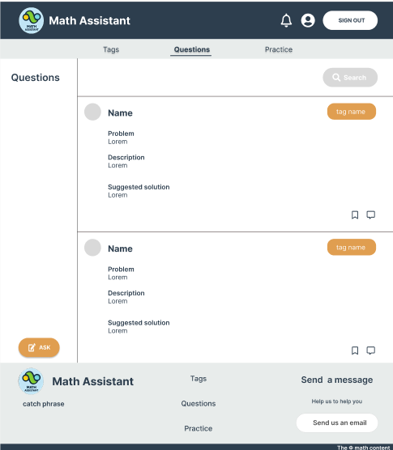

<div align="center">

> Hello world! This is the project’s summary that describes the project plain and simple, limited to the space available.

**[PROJECT PHILOSOPHY](https://github.com/julescript/well_app#-project-philosophy) • [WIREFRAMES](https://github.com/julescript/well_app#-wireframes) • [TECH STACK](https://github.com/julescript/well_app#-tech-stack) • [IMPLEMENTATION](https://github.com/julescript/well_app#-impplementation) • [HOW TO RUN?](https://github.com/julescript/well_app#-how-to-run)**

</div>

<br><br>


> Math Assistant is the place where math isn't your problem anymore. When you're stuck while solving a math problem you can post your question on the website by scanning the problem or typing it. Users, will help you with the answer and you can accept the answer and vote for the answers to keep a better experience. The user will get notified if changes are done. And the best part, users can practice math problems and get feedback from the editors.

### User Stories

- As a user, I want to scan pictures, so that I can post a question quickly.
- As a user, I want to post questions and answers.
- As a user, I want to practice math by solving math problems and getting feedback.
- As a user, I want to accept suitable answers and vote for better answers.
- As a user, I want to search for question.

### Editor Stories

- As a editor, I want to check the users and data related to the website.
- As a editor, I want to add tags and practices.
- As a editor, I want to check user's solutions for a practice problem.

<br><br>


> This design was planned before on paper, then moved to Figma app for the fine details.
> Note that i didn't use any styling library or theme, all from scratch and using pure css modules

| Landing                                 | Login                              |
| --------------------------------------- | ---------------------------------- |
|            |        |
| Sign Up                                 | Tags                               |
|         |          |
| Question                                | Ask Question                       |
|      |   |
| Practice                                | Exercice                           |
|       |  |
| Solved Practice                         | Profile                            |
|  |   |

<br><br>


Here's a brief high-level overview of the tech stack the Well app uses:

- For a good user experience, this project uses Reacr.js. React.js is a free and open-source front-end JavaScript library for building user interfaces based on UI components.

- To keep the database scalable for this project, the website uses MySQL database. MySQL is an open-source relational database management system (RDBMS).A relational database organizes data into one or more data tables in which data may be related to each other; and it facilitates testing database integrity and creation of backups.

- This project uses also 2 third party APIs. The first is [Firebase](https://firebase.google.com/), integrated in this project for the notifications. The second is [Mathpix](https://mathpix.com/), its goal is to scan the pictures and extract math equations from it.

<br><br>


> Uing the above mentioned tecch stacks and the wireframes build with figma from the user sotries we have, the implementation of the app is shown as below, these are screenshots from the real app

| Landing              | Login                    |
| -------------------- | ------------------------ |
|        |              |
| Sign Up              | Tags                     |
| -------------------- | ------------------------ |
|        |               |

<br><br>


> This is an example of how you may give instructions on setting up your project locally.
> To get a local copy up and running follow these simple example steps.

### Prerequisites

This is an example of how to list things you need to use the software and how to install them.

- npm
  ```sh
  npm install npm@latest -g
  ```

### Installation

_Below is an example of how you can instruct your audience on installing and setting up your app._

1. Get a free API Key at [Firebase](https://firebase.google.com/)
2. Clone the repo
   ```sh
   git clone https://github.com/SourayaAbdelKader/math_assistant.git
   ```
3. Install NPM packages
   ```sh
   npm install
   ```
   Some dependence may cause conflicts, for that reason you can run the following command to solve them.
   ```sh
   npm install --force
   ```
4. Change the firebase configuration and mathpix App ID and App Key to match your configuration details in the frontend.
5. In the backend, change the name of the file from .env.example to .env . And connect Laravel to your database.
6. After finishing all the steps above, you can now run the project by entering the following command:
   ```sh
   npm start
   ```

Enjoy the experience!
